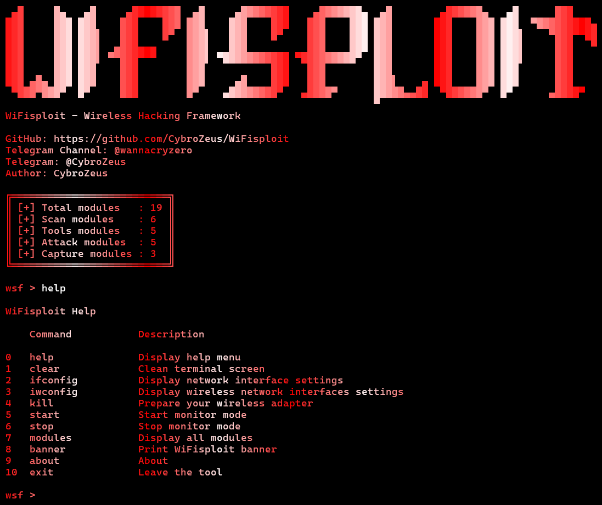

# WiFisploit - Wireless Hacking Framework

**WiFisploit** is a powerful Python-based tool for **Wi-Fi network penetration testing** and **security auditing**.
It offers a set of modules to **scan**, **analyze**, and **attack** wireless networks in both offensive and defensive security contexts.

⚠️ Use this tool **only for educational purposes** and with **explicit authorization**.

---

## 🧩 Features

- 🔐 Brute Force Wi-Fi passwords (WPA/WPA2)
- 📡 Crack captured handshakes
- 📴 Deauthentication (DoS) attacks
- 🎣 Honeypot attacks
- 🔎 WPS PIN Brute Force
- 🎧 Packet sniffing & traffic capture
- 🌐 Network & device scanning
- 🧠 Modular and interactive command-line interface

---

## 🖼️ Screenshot of the WiFisploit



## Update your system
apt update && apt full-upgrade -y

## 📦 Installation

```bash
git clone https://github.com/CybroZeus/WiFisploit.git
cd WiFisploit/wsf/
```

## Run the tool
python3 wsf.py

⚠️ Disclaimer
This tool is for educational purposes and authorized penetration testing only.
Do not use on networks you don't own or have permission to test.
The developer is not responsible for misuse.