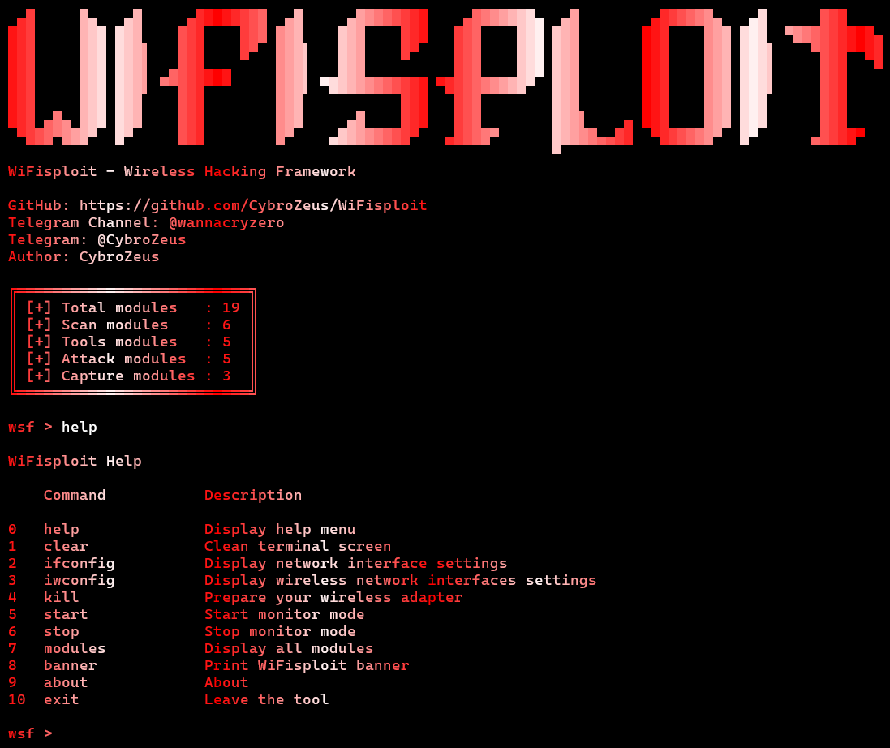

### WiFisploit - Wireless Hacking Framework

**WiFisploit** is a powerful Python-based tool for **Wi-Fi network penetration testing** and **security auditing**.
It offers a set of modules to **scan**, **analyze**, and **attack** wireless networks in both offensive and defensive security contexts.

⚠️ Use this tool **only for educational purposes** and with **explicit authorization**.

---

## 🧩 Features

- 🎣 **Honeypot attacks**
- 🔎 **WPS PIN Brute Force**
- 📡 **Crack captured handshakes**
- 🌐 **Network & device scanning**
- 📴 **Deauthentication (DoS) attacks**
- 🎧 **Packet sniffing & traffic capture**
- 🔐 **Brute Force Wi-Fi passwords (WPA/WPA2)**
- 🧠 **Modular and interactive command-line interface**

---

## 🖼️ Screenshot of the WiFisploit



## 📦 Installation

```bash
git clone https://github.com/CybroZeus/WiFisploit.git
```

```bash
cd WiFisploit
```

## Run the setup

```bash
bash WFInstall.sh
```

## Run the tool

```bash
cd wsf
```

```bash
python3 wsf.py
```

⚠️ **Disclaimer**
The developer is not responsible for misuse.
Do not use on networks you don't own or have permission to test.
This tool is for educational purposes and authorized penetration testing only.

## *Developed By CybroZeus*

## Contact

- 👤 [Telegram](https://t.me/CybroZeus)

## Support

- 📣 [Telegram Channel](https://t.me/wannacryzero)
- 💬 [Telegram Group Chat](https://t.me/wannacrychat0)
